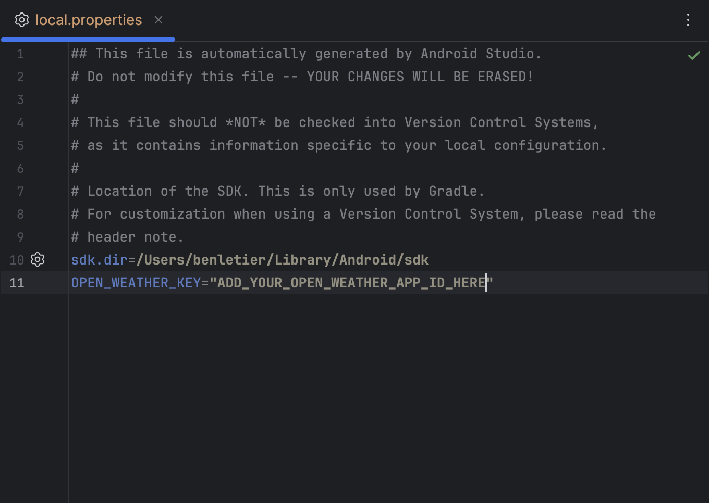

MVP: WARP
==================
A simple weather application using Kotlin and Jetpack Compose

# Configuration
Add your open weather api key in the local.properties file:




# Installation
```bash
./gradlew app:installDebug
```

# Technology
- `Kotlin`
- `Jetpack Compose`
- `Hilt Dependency-Injection`
- `Retrofit`
- `OkHttpClient`
