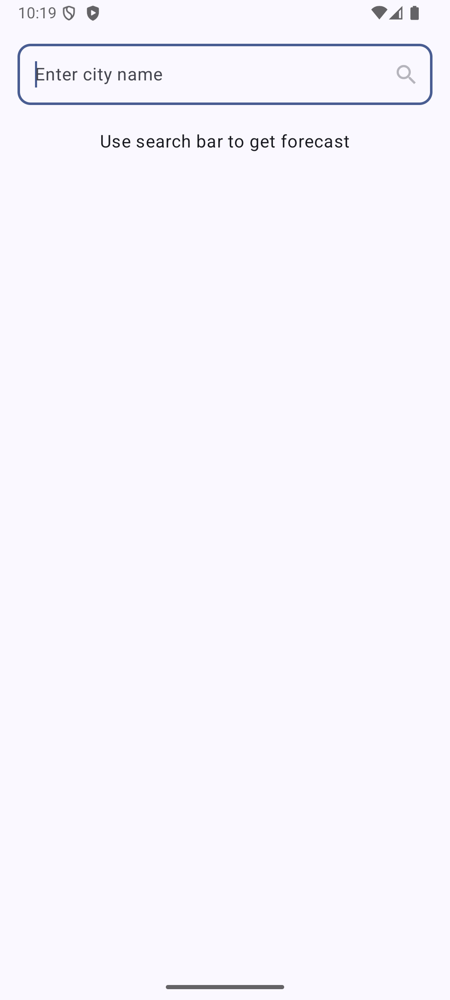
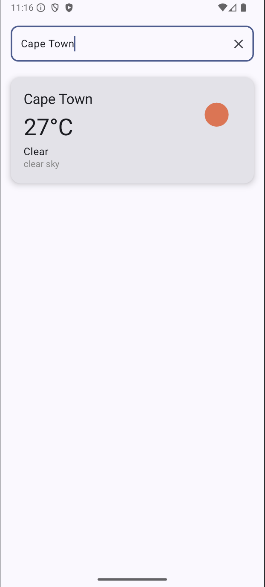
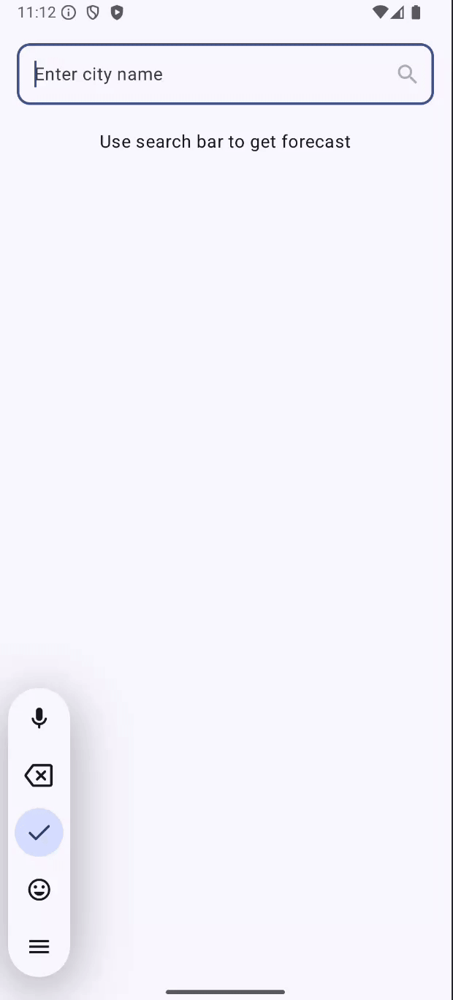
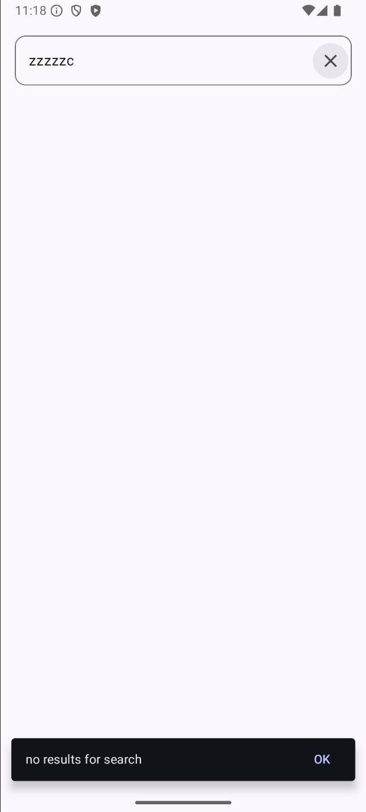
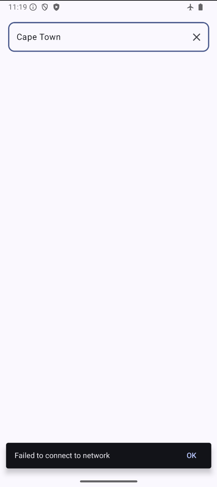

MVP: WARP
==================
A simple weather application using Kotlin and Jetpack Compose. The architecture used is both adaptive and layered. A unidirectional data flow (UDF) was used in all layers of the app, which means higher layers react to changes in lower layers.

# Configuration
- Devices must have an Android version of 7.0 (API 24) or higher to install and run the app.
- Add your [Open Weather](https://openweathermap.org/current) api key in the local.properties file:


# Installation
```bash
./gradlew app:installDebug
```

# Features

A real-time search bar that integrates with an [Open Weather](https://openweathermap.org/current)  endpoint to retrieve daily forecast for cities around the world.
<br /><br />
The forecast includes details like:
- City Name
- Temperature in Celsius
- Weather condition
- An icon to reflect the weather condition
- A brief description of the weather conditions.

## Screenshots

 |  |  
<br /><br />
 |  | 


# Technology
- `Kotlin`
- `Jetpack Compose`
- `Hilt Dependency-Injection`
- `Retrofit`
- `OkHttpClient`
